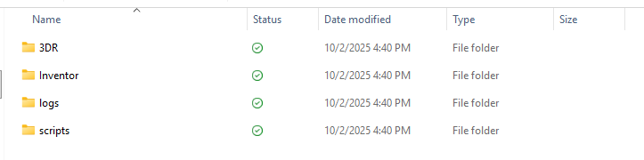
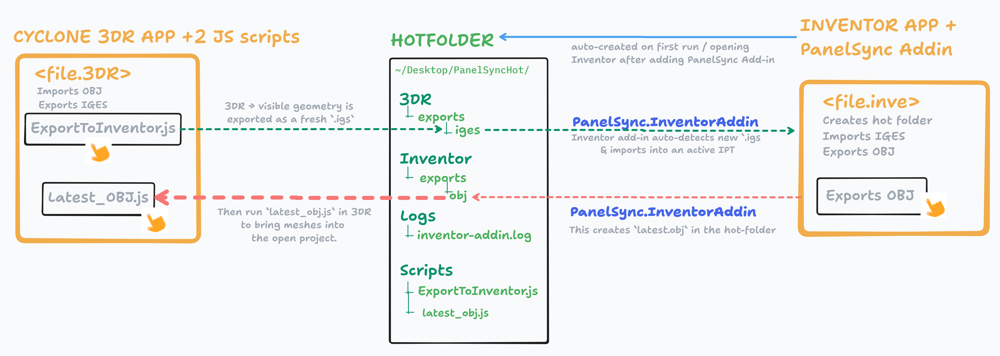

# PanelSync – 3DR ↔ Inventor Hot-Folder Bridge (Lightweight Edition)

A tiny, reliable pipeline that lets Leica **Cyclone 3DR** and **Autodesk Inventor** trade geometry with almost no clicks.  

Runs via:
- An **Inventor add-in** (auto-creates hot-folder, seeds scripts, adds an Export OBJ button).
- Two **3DR scripts** (`ExportToInventor.js` + `latest_obj.js`) that you add once to Favorites.

---

## ✨ What you can do

- **3DR → Inventor (IGES):**  
  Run `ExportToInventor.js` in 3DR → visible geometry is exported as a fresh `.igs` into the hot-folder.  
  The Inventor add-in auto-detects it and imports into an active IPT (atleast one ipt has to be open).

- **Inventor → 3DR (OBJ):**  
  Click the **Export OBJ → 3DR** ribbon button in Inventor.  
  This creates `latest.obj` in the hot-folder.  
  Then run `latest_obj.js` in 3DR to bring meshes into the open project.

- **Zero-tears file I/O:**  
  IGES always exported with a unique timestamped name, OBJ always constant `latest.obj`.  
  File watchers ensure Inventor only imports stable IGES files.

---

## 🗂 Folder map (auto-created on first run / opening Inventor after adding PanelSync Add-in)

```
~/Desktop/PanelSyncHot/
├─ 3DR/
│  └─ exports/
│     └─ iges/          # IGES from 3DR
├─ Inventor/
│  ├─ projects/         # IPT files (Inventor side)
│  └─ exports/
│     └─ obj/           # latest.obj always written here
├─ logs/                # inventor-addin.log
└─ scripts/             # 3DR scripts (seeded automatically, add both of these as Favorite Script in 3DR)
   ├─ ExportToInventor.js 
   └─ latest_obj.js
```

- 

---

## ⚙️ Prerequisites

- **Windows 10/11**
- **Autodesk Inventor** (2022+) with permission to load add-ins
- **Leica Cyclone 3DR** with scripting enabled (`SPoly`, `SCADUtil`, etc.)
- **Visual Studio 2022** (.NET Framework/.NET 8 workloads) to build the add-in

---

## 🚀 Quick start

1. **Clone** this repo.  

2. **Install the Inventor add-in**  
   1. Build the solution so the Inventor add-in assembly exists.  
   2. Create an `.addin` XML file (e.g., `PanelSync.InventorAddIn.addin`) in one of the Inventor add-in folders, commonly:  
      - `%APPDATA%\Autodesk\Inventor <version>\Addins\`  
      - or `%PROGRAMDATA%\Autodesk\Inventor <version>\Addins\`  
   3. Use this template (update the `Assembly` path to your compiled DLL and keep the `Guid`):  

   ```xml
   <Addin Type="Standard">
         <DisplayName>PanelSync</DisplayName>
         <Description>Syncs 3DR IGES ↔ Inventor OBJ via hot-folder</Description>
         <Assembly>C:\Path\To\Your\Build\PanelSync.InventorAddIn.dll</Assembly>
         <ClassId>{B2C7C23E-18B0-4A11-9B0B-8C6B16E30F11}</ClassId>
         <FullClassName>PanelSync.InventorAddIn.AddInServer</FullClassName>
         <LoadOnStartUp>1</LoadOnStartUp>
         <UserUnloadable>1</UserUnloadable>
         <Hidden>0</Hidden>
         <SupportedSoftwareVersionGreaterThan>24..</SupportedSoftwareVersionGreaterThan>
         <DataVersion>1</DataVersion>
         <UserInterfaceVersion>1</UserInterfaceVersion>
   </Addin>
   ```

   4. Start Inventor → go to **Add-In Manager** → check if PanelSync is added.  
   -   

   ✅ On first run, the add-in creates the `PanelSyncHot` folder structure, logs, and seeds scripts.

---

3. **Set up 3DR Favorites** (first time only)  
   - Open Cyclone 3DR → `Settings → Favorite Scripts`.  
   - Add:  
     - `PanelSyncHot\scripts\ExportToInventor.js`  
     - `PanelSyncHot\scripts\latest_obj.js`  

   This ensures the OBJ import script is always ready in 3DR — no browsing each time.  

   -   

   1. Open **Cyclone 3DR**.  
   2. Go to **Home → Settings → Favorite Script**.  
   3. Click **Add Favorite → From Disk…**.  
   4. Browse to your Desktop hot-folder path (it may be under OneDrive on some setups):  

      ```
      C:\Users\<YourUserName>\OneDrive\Desktop\PanelSyncHot\scripts\latest_obj.js
      ```

   5. Select the file and click **OK**.  
      ✅ The favorite script is now saved.  

   -   

   From now on:  
   - Every time you open 3DR, the favorite is already available.  
   - After you export OBJ from Inventor, just click the ⭐ **PanelSync Import OBJ** favorite inside 3DR to import meshes.

---

4. **Use the loop:**  
   - In **3DR**: Run **ExportToInventor.js** → IGES exported → auto-imported into Inventor.  
   - In **Inventor**: Work on the IPT. When ready, click **Export OBJ → 3DR** button (Tools tab).  
   - In **3DR**: Run **latest_obj.js** → OBJ imported into the open project.  

✅ That’s it: **2 clicks in 3DR + 1 click in Inventor.**

---

## 📜 Scripts

- **ExportToInventor.js**  
  - Always writes a new `exp_<timestamp>.igs` to `3DR\exports\iges`.  
  - Filters visible geometry (lines, circles, polylines, multilines, planes, rectangles).  
  - Handles Multiline properly by splitting into segments.

- **latest_obj.js**  
  - Always imports `Inventor\exports\obj\latest.obj`.  
  - Adds all meshes to the open 3DR project.  
  - Updates the view, with log messages for each mesh.

---

## 🪪 Troubleshooting

- **Nothing imports to Inventor:**  
  Check `PanelSyncHot\logs\inventor-addin.log`. Ensure add-in is loaded.  

- **OBJ not created:**  
  Make sure you have a Part document open with solid bodies.  

- **3DR didn’t import OBJ:**  
  Run `latest_obj.js` manually — check if `latest.obj` exists in the exports folder.  

- **Every time you solve issue** tell how you here (or write to me) so it’s helpful to all.
---

## 🗺️ Conceptual workflow

- 

---

## 📄 License

MIT (or your preferred license).
